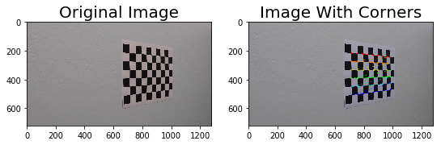
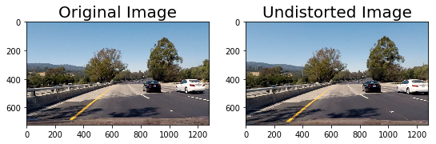
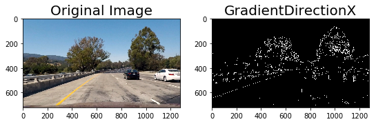
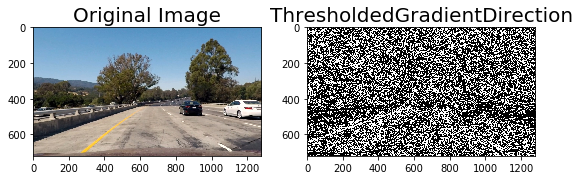
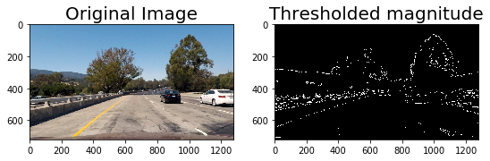
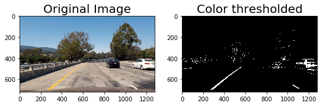
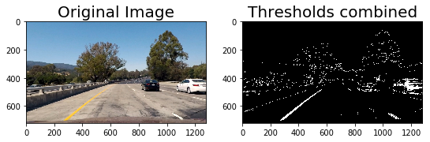
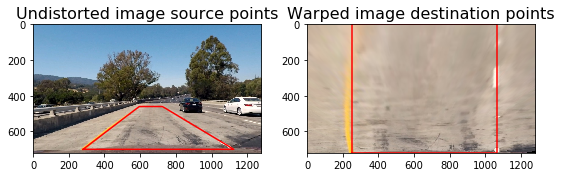
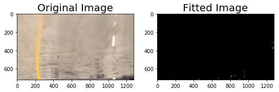
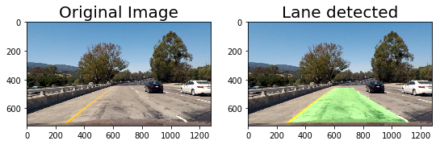

**Advance Finding Lane Lines**
---
The goals of this project are the following:
Write a software pipeline to identify the lane boundaries in a video from a front-facing camera on a car. The camera calibration images, test road images are given as input. The pipeline shall output an annotated video with the lane detection. The video will identify:

* The positions of the lane lines
* The location of the vehicle relative to the center of the lane
* The radius of curvature of the road

### Description
---
The pipeline chosen contains in nine steps:
- **Camera calibration**: The images for camera calibration are stored in the folder called `camera_cal`. Computation of the camera matrix is done in this step. 

- **Distortion correction**: Based on the output of the **camera calibration** step the distortion co-efficients are computed here to help undistort the image.

- **Applying color and gradients thresholds**: Applying thresholds on gradients and colors (in RGB and HLS color spaces) to obtain a binary thresholded image.

- **Perspective transform (birds-eye view)**: Extracting the vertices to perform a perspective transform. The polygon with these vertices is drawn on the image for visualization. Also the polygon is applied to the warped image.

- **Detect lane pixels (sliding window search) to find the lane boundary**: Detect line pixels using sliding windows technique and perform search for similar lines to get the upfront polygon to be drawn. 

- **Determine the curvature of the lane and vehicle position with respect to center**: Determine the right and left lanes curvatures and center offset of the camera.
- **Draw lane with curvature and boundaries**: Draw the polygon on the lane based on previously determined curvatures and center offset.
 
- **Display the lane boundaries and numerical estimation of lane curvature and vehicle position**: The calculated curvatures of the lanes and center offset are displayed as text on the resulted image.

- **Run pipeline and save the final output video**: Run the pipeline, compose video and run video on the notebook. The video is saved under name `project_video_solution.mp4`.

### Improvements
- I made the  **print_images** helper function in order to print the images each step at runtime based upon flags passed to the **cv2.cvtColor** function. Selected images were saved in output_images folder as a two subplot image. Each step the first image is the input. Second image is the result.
- I made the Pipeline class that calls in sequence every method defined at previous steps in order to make the video.

---
### Issues and Challenges
- The printing/poltting of the images sometimes do not work as expected (e.g. I wasn't able to plot the sliding windows) eventhough the functions and pipeline work as expected
- The algorithm can be improved to identify transitions from bright light to shadows and car mechanical vibrations correction maybe for the challange video. Not too much time to address this now :)
- The thresholds limtits for the gradients and choosing right kernel can give better results.
- Choosing the kernel size was really time consuming and result in a lot of trials and errors until finding the right warped image. 

    
    
    
    
   
